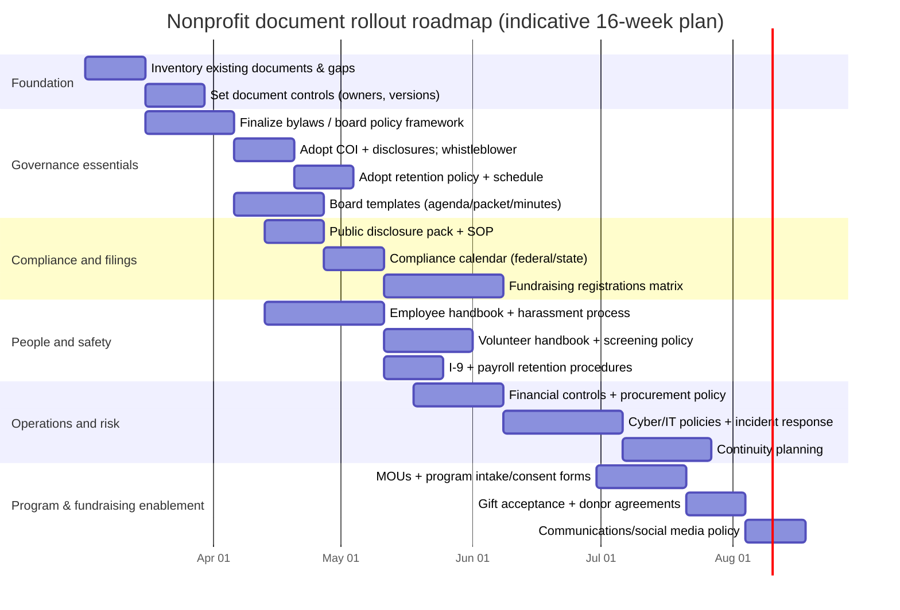

# Key Documents Every Public-Facing Nonprofit With Volunteers and Paid Staff Should Maintain

## Executive summary

Public-facing nonprofits with both volunteers and paid staff need a **document portfolio** that does four things: (1) **establishes lawful existence and governance authority**, (2) **demonstrates compliance** to regulators and funders, (3) **standardizes people practices** (employees/volunteers) to reduce legal and safety risk, and (4) **creates operational repeatability** (finance, IT, records, program delivery). citeturn0search2turn13search0turn1search0turn9search16

A practical way to manage this is to treat the portfolio as three tiers:

- **Essential**: documenten that are legally required in most cases (or are effectively mandatory to run safely and pass routine diligence), including **organizing documents, bylaws, board minutes, tax filings/public disclosure set, core governance policies, employee basics, and recordkeeping controls**. citeturn5search8turn13search0turn0search1turn2search0turn2search1  
- **Important**: documents strongly expected by donors, auditors, and charity evaluators, and/or needed to manage operational and reputational risk (e.g., **gift acceptance, volunteer screening, incident reporting, cybersecurity governance**). citeturn1search2turn1search10turn12search1turn6search0turn6search3  
- **Optional / situational**: documents triggered by operations (youth programs, healthcare data, federal awards, vehicles, clinical services, etc.). For example, **youth safeguarding** becomes essential if the organization serves minors. citeturn6search1turn6search9turn4search3turn8search0  

Two high-impact insights drive prioritization:

- The **annual federal information return (Form 990 series)** is public, and it explicitly asks about governance practices and certain policies (conflict of interest, whistleblower, record retention, minutes, and more). Those disclosures influence funder/donor confidence and are used by charity evaluators. citeturn0search1turn13search3turn1search10turn1search2  
- Certain governance protections are not just “nice-to-have.” For example, federal law includes criminal provisions relevant to **retaliation against whistleblowers** and **destruction of records** (commonly discussed under Sarbanes–Oxley implications), which is why many nonprofits adopt whistleblower and record-retention controls. citeturn3search3turn4search2turn0search1turn3search29  

Key authoritative sources used throughout include: entity["organization","Internal Revenue Service","us federal tax agency"] (exempt status, filings, public disclosure), entity["organization","National Council of Nonprofits","us nonprofit association"] (governance and policy best practices), entity["organization","BoardSource","nonprofit board resource org"] (board governance templates), entity["organization","Charity Navigator","nonprofit charity evaluator"] (transparency/accountability criteria), and entity["organization","Nonprofit Risk Management Center","nonprofit risk center"] (risk, insurance, volunteer screening, youth protection). citeturn13search0turn1search0turn11search3turn1search10turn6search0  

## Prioritization model and document lifecycle

### Jurisdiction and “must” versus “best practice”

Because nonprofit law is a **federal + state** stack, “required” depends on where you are incorporated, where you operate, where you solicit donations, and what services you provide. The federal layer (tax exemption, IRS filings, immigration employment verification, wage/hour, etc.) is relatively consistent; the state layer varies substantially (charitable solicitation registration, employment rules, privacy/breach notification, etc.). citeturn0search15turn9search13turn2search0turn2search1turn7search0  

This report therefore labels each document as:

- **Essential**: widely required or functionally mandatory for safe operations and routine diligence
- **Important**: strong best practice; frequently requested by funders/auditors/insurers; materially reduces risk
- **Optional / situational**: required only under certain operating conditions (e.g., youth-serving, federal awards, health data)

### Governance controls for the document system itself

Independent of document content, high-performing nonprofits implement “document governance”:

- A **single source of truth** (document repository), versioned policy library, and clear “effective date / supersedes” conventions  
- A **document approval workflow** separating *drafting* (staff/ED/committees) from *adoption* (board for governance-level policies)  
- A **review cadence** tied to a compliance calendar and real triggers (law changes, incidents, new programs, new fundraising channels) citeturn9search16turn0search1turn3search7turn6search2  

This matters because IRS public disclosure rules require you to be able to produce certain documents (exemption application materials and annual returns), and because good recordkeeping accelerates compliance reviews and examinations. citeturn13search0turn3search7turn0search2  

## Prioritized checklist with playbook entries

Each entry below includes: **purpose; who drafts/approves; legal/regulatory relevance; recommended sections; minimum vs best practice; typical format; review frequency; template sources**. Where state-specific variation is common, it is called out explicitly.

### Governance and board records

**Articles of incorporation / organizing document** — **Essential**  
Purpose: Creates the legal entity and, for 501(c)(3), must embed purpose and asset-dedication constraints used in the IRS “organizational test.” citeturn5search25turn0search2turn5search8  
Draft/approve: Draft by legal counsel or experienced incorporator; approved/authorized by incorporator/initial directors per state process; board retains final executed copy.  
Legal/regulatory relevance: State nonprofit corporation law; IRS exemption “organizational test” and dissolution/purpose expectations. citeturn5search25turn5search1turn5search8  
Recommended sections: name, nonprofit purpose, member structure (if any), registered agent, initial directors, limitations on political campaign activity where applicable, dissolution/asset dedication clause. citeturn5search4turn5search25  
Minimum vs best practice: Minimum = state-required fields + IRS-compatible purpose/dissolution; Best = also anticipates governance model (members vs no members), indemnification interactions, and alignment with bylaws. citeturn5search25turn5search8  
Typical format: State form + attachments; stored PDF.  
Review: On formation; then only when amended (major mission/governance change).  
Templates/sources: IRS sample organizing documents and suggested language for articles. citeturn5search8turn5search1turn0search2  

**Bylaws** — **Essential**  
Purpose: The organization’s internal governance “operating system” (board structure, officer roles, meetings, voting, committees). citeturn0search2turn9search16  
Draft/approve: Draft by governance committee + ED + counsel; approved by board (and members if member-based).  
Legal/regulatory relevance: State nonprofit corporation statutes typically contemplate/require bylaws; IRS exemption review frequently considers governance consistency with exempt purpose. citeturn0search2turn5search4  
Recommended sections: board size/terms, quorum/voting, conflict management basics, officer duties, committees authority, meeting notice requirements, amendment process, member provisions if applicable.  
Minimum vs best practice: Minimum = legally operable governance rules; Best = explicit delegation limits (e.g., who can sign contracts), remote meeting rules, committee charters aligned, indemnification references coordinated with insurance and state law. citeturn10search1turn10search11turn9search16  
Typical format: Policy-style document; board resolution adopting.  
Review: Annually for fit; formally amend as needed.  
Templates: IRS lifecycle resources; governance-resource providers; state nonprofit associations (varies). citeturn0search2turn9search16  

**Board policy framework (Board policy manual or “governance policies”)** — **Essential**  
Purpose: Consolidates board-adopted policies (ethics, conflicts, whistleblower, record retention, gift acceptance, executive compensation practices, etc.), clarifies what the board sets versus what staff procedures implement. citeturn11search29turn9search16turn0search1  
Draft/approve: Governance committee drafts with ED; board approves.  
Regulatory relevance: Form 990 governance questions focus on presence and management of certain policies; public evaluators review those disclosures. citeturn0search1turn1search10turn1search2  
Recommended contents: policy list + owners; approval authorities; review cadence; cross-reference operational SOPs.  
Minimum vs best: Minimum = core policies present; Best = coherent policy hierarchy (board policy → staff procedure → forms), version control, and training/attestation tracking. citeturn11search29turn6search2  
Format: Policy manual + index.  
Review: At least annually (board).  
Templates: Board policy checklists and policy samplers. citeturn11search4turn11search14  

**Board member job description and board roles/responsibilities** — **Important**  
Purpose: Sets expectations, supports recruitment, improves fiduciary performance. citeturn1search5turn1search9  
Draft/approve: Governance committee drafts; board approves; used in onboarding.  
Regulatory relevance: Not a statutory filing, but directly supports governance effectiveness and oversight of assets. citeturn1search9turn9search16  
Recommended sections: fiduciary duties, attendance and preparation, committee service, fundraising expectations, confidentiality, conflicts disclosure, term expectations. citeturn1search5turn11search3  
Minimum vs best: Minimum = duties + time expectations; Best = measurable commitments (e.g., meeting cadence) and annual acknowledgment.  
Format: Template + signed acknowledgment.  
Review: Every 1–2 years or when board model changes.  
Templates: Board member job description template; alternatives exist via nonprofit governance guides. citeturn1search5turn1search9  

**Board meeting agendas, packets, minutes, and resolutions** — **Essential**  
Purpose: Creates the legal record showing governance actions, duty-of-care process, and approvals (budget, senior executive compensation, policy adoption). Minutes and recordkeeping are explicitly referenced as a governance practice in Form 990 (Part VI). citeturn0search1turn1search0turn9search4  
Draft/approve: Board chair/secretary set agenda and minutes; ED compiles packet; board approves minutes.  
Legal/regulatory relevance: State corporate law often requires retaining minutes; IRS asks about documenting meetings and governance practices; good minutes support defense in disputes and audits. citeturn0search1turn7search7turn11search29  
Recommended contents (agenda/packet): consent agenda; dashboard KPIs; finance reports; action items and decision memos; policy proposals; committee reports. citeturn9search4turn1search0  
Minimum vs best: Minimum = agenda + minutes reflecting motions/approvals; Best = pre-reads distributed in advance, written decision rationale for major approvals, and retention in a controlled archive. citeturn9search4turn6search2  
Format: agenda template; packet checklist; minutes template.  
Review: Every meeting; minutes approved next meeting.  
Templates: strategic/traditional agenda samples; governance resources offer agenda/minutes templates. citeturn9search4turn9search1turn9search10  

**Conflict of interest policy + annual disclosure form** — **Essential**  
Purpose: Defines conflicts, requires disclosure, and establishes how conflicted persons are managed (recusal, documentation). IRS Form 990 and Form 1023 materials emphasize conflict-of-interest governance as risk-reduction. citeturn0search1turn0search8turn0search4  
Draft/approve: Governance committee + counsel draft; board approves; annual disclosure collected by board chair/secretary.  
Legal/regulatory relevance: Not always required to obtain exemption, but explicitly asked about on Form 1023 and Form 990; also core to preventing private inurement and improper benefit concerns. citeturn0search0turn0search1turn0search8  
Recommended sections: definitions; duty to disclose; procedures (determine conflict, manage it); documentation in minutes; annual disclosures; violations and enforcement. citeturn0search8turn11search3  
Minimum vs best: Minimum = disclosure + recusal + documentation; Best = includes conflicts in compensation setting, procurement/vendor selection, and grants; includes annual questionnaire and training. citeturn0search8turn4search3turn11search3  
Format: policy template + disclosure form.  
Review: Annually; re-affirm disclosures annually. citeturn1search0turn11search3  
Templates: Board governance COI samples; IRS sample policy in Form 1023 instructions; governance policy samplers. citeturn0search0turn11search3turn11search8  

**Whistleblower policy** — **Essential**  
Purpose: Provides reporting channels and anti-retaliation protections for reporting illegal/unethical conduct, including financial mismanagement; Form 990 asks whether it exists. citeturn0search1turn1search2turn11search6  
Draft/approve: Audit/finance committee + counsel draft; board approves; typically integrated into employee and volunteer handbooks. citeturn11search6turn11search1  
Legal/regulatory relevance: Federal criminal law includes anti-retaliation and record-protection context; best practices explicitly recommended in governance frameworks; also disclosed on Form 990. citeturn3search3turn0search1turn3search29  
Recommended sections: scope; reporting options (including outside chain of command); confidentiality; investigation process; non-retaliation; documentation and corrective actions. citeturn11search6turn11search1  
Minimum vs best: Minimum = reporting + non-retaliation + investigation responsibility; Best = independent reporting route (audit committee), documented triage and response SLAs, and training/awareness. citeturn2search2turn11search6  
Format: policy template + reporting form.  
Review: Annually or after any report/event.  
Templates: governance whistleblower policy templates. citeturn11search1turn11search6turn1search2  

**Document retention and destruction policy + retention schedule** — **Essential**  
Purpose: Defines how long records are kept and how destruction is controlled; Form 990 asks about document retention policy; federal law criminalizes destruction of records in certain contexts. citeturn0search1turn4search2turn3search3  
Draft/approve: Finance/audit committee drafts with counsel and operations; board approves.  
Legal/regulatory relevance: Form 990 disclosure; IRS recordkeeping expectations; Sarbanes–Oxley-adjacent document protection concerns (obstruction statutes). citeturn0search1turn3search7turn4search2  
Recommended sections: record categories; retention periods; legal holds; secure destruction; responsibility matrix; electronic records and backups. citeturn11search7turn3search7  
Minimum vs best: Minimum = retention schedule + legal hold rule + destruction controls; Best = integrates cyber/backup policy and privacy/data minimization, and assigns “records custodian.” citeturn6search3turn11search7  
Format: policy + spreadsheet schedule + legal hold notice template.  
Review: Annually and when regulations change.  
Templates: sample retention policies and worksheets. citeturn11search7turn11search0turn11search30  

### Legal, tax, filings, and public disclosure

**Federal tax exemption application package + determination letter set** (Form 1023 or 1023‑EZ, attachments, correspondence, determination letter) — **Essential (if claiming 501(c)(3) tax exemption)**  
Purpose: Establishes federal recognition of exemption; determination letter is a foundational compliance artifact. citeturn5search0turn13search7  
Draft/approve: ED/treasurer draft with counsel/CPA; board authorizes submission and adopts key policies referenced in the application.  
Legal/regulatory relevance: Recognition of exemption under §501(c)(3); organizing and operational tests; many funders request the determination letter. citeturn5search0turn0search2turn0search8  
Recommended contents: organizing documents; narrative of activities; compensation/conflict policies; financial projections; required clauses. citeturn0search0turn5search0  
Minimum vs best: Minimum = complete submission with required attachments; Best = includes governance policies early and operational controls aligned to what you describe in narrative. citeturn0search0turn5search0  
Format: electronic filing package; retained PDF.  
Review: No periodic “review,” but retain permanently; update internal policies as operations evolve.  
Templates/sources: Form 1023 instructions and IRS supporting resources. citeturn0search0turn5search0turn5search4  

**Annual federal filings (Form 990 / 990‑EZ / 990‑N; plus any required schedules, and 990‑T if applicable)** — **Essential (for most exempt orgs)**  
Purpose: Annual compliance and public transparency; contains governance disclosures. citeturn0search1turn13search3turn13search9  
Draft/approve: Finance staff/CPA drafts; ED and treasurer review; board (or finance/audit committee) best-practice reviews before filing. citeturn0search5turn11search13turn5search2  
Legal/regulatory relevance: Required annual reporting; public inspection rules under §6104; donors and evaluators access it. citeturn13search6turn13search3turn1search10  
Minimum vs best: Minimum = accurate timely filing; Best = formal board review process and consistent narratives (Schedule O) aligned to mission and controls. citeturn5search2turn5search19turn0search1  
Format: IRS filing + internal review checklist.  
Review cadence: Annual; mid‑year prep recommended.  
Templates: IRS instructions; board review process guidance. citeturn0search1turn5search19turn0search5  

**Public disclosure pack** (what you must produce upon request: exemption application, determination letter, and annual returns) — **Essential**  
Purpose: Ensures you can comply quickly with public inspection/copy rules. citeturn13search0turn13search4  
Draft/approve: Compliance owner (ED/CFO) compiles; board informed.  
Legal/regulatory relevance: IRS rules require exempt organizations to make exemption applications and annual returns available for public inspection. citeturn13search0turn13search6turn13search4  
Minimum vs best: Minimum = ready-to-produce files (redacting donor identifiers where permitted); Best = publishes on website proactively and trains staff on responding to requests. citeturn13search0turn13search3turn13search1  
Format: PDF bundle + request-response SOP.  
Review: Quarterly check for completeness; after each filing.  
Notes: Form 990 instructions clarify that for many organizations contributor names/addresses on Schedule B are not required to be publicly disclosed. citeturn13search3turn13search8  

**State registrations and periodic reports** (incorporation maintenance, annual/biennial reports, state tax exemptions) — **Essential, but state-specific**  
Purpose: Maintains corporate good standing and state tax posture.  
Draft/approve: CFO/operations + counsel; board informed.  
Legal/regulatory relevance: varies by state. Generally requires a compliance calendar due to varying deadlines and portals. citeturn9search16turn6search2  
Format: filings + retained confirmations.  
Review: Annual.

**Charitable solicitation registration + renewals (including multi-state fundraising)** — **Essential for organizations soliciting donations, but state-specific**  
Purpose: Legally authorizes fundraising solicitations in many states; prevents stop orders/penalties and reputational harm. citeturn0search15turn9search13  
Draft/approve: Development + finance compile; ED authorizes; board oversight (audit/finance/governance).  
Regulatory relevance: Many states require registration before soliciting residents; exemptions vary; multi-state online fundraising increases complexity. citeturn0search15turn9search13turn9search30  
Minimum vs best: Minimum = registered where required + renewals; Best = maintains a matrix of state rules, uses a unified workflow, and monitors online solicitation triggers. citeturn9search13turn9search30  
Format: state portal filings; matrix; compliance calendar.  
Review: Quarterly compliance review; renewal cycle per state.  
Templates/sources: The Unified Registration Statement was created as a multi-state effort and is hosted with supporting materials, but acceptance varies by state and many require state-specific supplements or portals. citeturn9search2turn0search7turn0search11  
Regulator navigation source: NASCO provides links and context for state charity oversight roles. citeturn9search6turn9search30  

**Insurance policies + proof of coverage file** — **Essential (with state-specific mandates like workers’ comp)**  
Purpose: Transfers risk; many contracts and venues require certificates of insurance; workers’ compensation is commonly required by state law when employees exist. citeturn10search1turn10search11turn10search29  
Draft/approve: CFO/operations works with broker; board reviews D&O limits and governance implications. citeturn10search7turn10search11turn10search21  
Recommended coverage set: Commercial general liability is commonly the core; D&O protects governance decisions; also consider EPLI, auto, property, cyber depending on operations. citeturn10search1turn10search11turn10search7  
Minimum vs best: Minimum = CGL + workers’ comp (if required) + D&O; Best = annual coverage gap review, contract review procedures, and incident reporting process aligned to insurer requirements. citeturn10search1turn10search6turn6search2  
Format: policy binder + renewal checklist + COI templates.  
Review: Annually and when operations change.

### HR, volunteer management, and personnel records

**Employee handbook** — **Essential (if you have employees)**  
Purpose: Sets terms, reduces employment-law risk, standardizes expected conduct (harassment, nondiscrimination, leave, discipline), and supports consistent management processes. citeturn1search1turn2search2turn1search28  
Draft/approve: HR/ED drafts with counsel; board approval depends on governance model (often board approves high-level employment policies while ED implements). citeturn11search29turn1search1  
Regulatory relevance: Employment laws apply to nonprofits; anti-harassment complaint channels and anti-retaliation expectations are emphasized by the federal employment agency. citeturn1search1turn2search2turn2news41  
Recommended sections: EEO and nondiscrimination; harassment prevention/complaint process; wage/hour/timekeeping; leave; accommodations; discipline; confidentiality; tech/social media; reporting misconduct. citeturn2search2turn2search1turn12search4  
Minimum vs best: Minimum = legally essential policies and complaint channels; Best = training cadence, multiple reporting paths, investigation SOP, and annual acknowledgment. citeturn2search2turn11search6  
Format: handbook + acknowledgment form.  
Review: At least annually; immediately upon major law changes (state-heavy area).  
Templates: sample employee handbook templates published via nonprofit sector resources. citeturn1search28turn1search1  

**Volunteer handbook / volunteer policies handbook** — **Important (often Essential for public-facing volunteer programs)**  
Purpose: Clarifies volunteer eligibility, conduct, supervision, safety, reporting, and dismissal—mirrors many employee expectations and reduces negligent-supervision risk. citeturn1search12turn6search0  
Draft/approve: Volunteer manager/operations drafts with HR/ED; board approves code-of-conduct level policy where relevant.  
Regulatory relevance: Background checks and screening practices are common especially when volunteers interact with vulnerable groups; documentation supports insurer and stakeholder expectations. citeturn1search12turn6search0turn6search20  
Recommended sections: eligibility and onboarding; role expectations; safeguarding; confidentiality; expense reimbursement; incident reporting; discipline/dismissal; media/photo rules. citeturn6search1turn6search2turn12search4  
Minimum vs best: Minimum = conduct + safety + reporting; Best = role-based screening tiers, ongoing supervision, and signed acknowledgments. citeturn6search0turn6search20  
Format: handbook + volunteer agreement and acknowledgments.  
Review: Annually and after incidents.  
Templates: state nonprofit association volunteer policy template(s). citeturn1search32turn1search12  

**Job descriptions (employees and key volunteer roles)** — **Essential**  
Purpose: Defines duties, required qualifications, physical requirements, reporting lines, and performance criteria; supports compliance and consistent HR decisions. citeturn1search1turn2search1  
Draft/approve: HR + hiring manager draft; ED approves; board approves ED job description and ED evaluation framework.  
Minimum vs best: Minimum = duties + classification basics; Best = mission alignment, decision authorities, safeguarding responsibilities, and required training.  
Format: template.  
Review: At least annually or with role changes.

**Offer letters / employment agreements + onboarding packet** — **Essential**  
Purpose: Establishes employment terms, at-will statements where applicable, confidentiality, and acknowledgments of key policies.  
Draft/approve: HR drafts with counsel; ED approves.  
Review: As laws/benefits change; use standard templates.

**Background check policy + FCRA disclosure/authorization and adverse action notices** — **Important (Essential for roles with risk exposure)**  
Purpose: Standardizes screening to reduce negligent hiring/supervision risk; ensures compliant use of consumer reports (background checks). citeturn6search0turn4search1turn4search5  
Draft/approve: HR drafts with counsel; ED approves; board informed for high-risk programs.  
Legal/regulatory relevance: Federal consumer-reporting law requires clear disclosure and written authorization before obtaining certain background reports; and has pre-adverse/adverse action notice steps. citeturn4search1turn4search5turn4search9  
Minimum vs best: Minimum = policy + standalone disclosure + authorization + adverse action workflow; Best = tiered screening by role risk and periodic rescreen cadence documented. citeturn6search20turn6search0turn4search1  
Format: policy + forms + decision matrix.  
Review: Annually; after any screening-related incident.

**Form I‑9 procedures and retention log** — **Essential (U.S. employers)**  
Purpose: Verifies employment eligibility; avoids serious penalties. citeturn2search23turn2search4  
Draft/approve: HR/operations implements; ED accountable.  
Legal/regulatory relevance: Employers must retain I‑9 for required period (three years after hire or one year after termination, whichever is later). citeturn2search0turn2search23  
Minimum vs best: Minimum = timely completion + correct retention; Best = internal audit process and secure separate storage from personnel files.  
Format: process checklist + retention tracker.  
Review: Ongoing; internal audit annually.

**Payroll and wage/hour recordkeeping system + retention rules** — **Essential**  
Purpose: Demonstrates wage/hour compliance and supports audits; required record retention periods exist for payroll and wage computation records. citeturn2search1turn4search0  
Draft/approve: Finance/HR implements; ED oversight; board oversight via finance committee for controls.  
Legal/regulatory relevance: Wage/hour records must be kept (commonly three years; supporting computation records two years under federal wage/hour rules); employment tax records retained at least four years. citeturn2search1turn4search0turn4search4  
Format: payroll system records + written retention schedule.  
Review: Annually (retention and controls).

### Operations, finance, IT/security, and continuity

**Financial internal controls policy (cash handling, segregation of duties, approvals, reconciliations)** — **Essential**  
Purpose: Prevents fraud and errors; creates auditable controls; supports fiduciary duty and grant compliance. citeturn8search7turn8search3  
Draft/approve: CFO/treasurer drafts; finance/audit committee and board approve.  
Regulatory relevance: For federal awards, written internal controls are explicitly required; more broadly, internal controls are a widely recognized governance expectation. citeturn8search0turn9search16turn8search7  
Recommended contents: authorization matrix; check signing; bank reconciliations; expense approvals; restricted funds handling; separation of duties (with compensating controls for small orgs). citeturn8search7turn8search3  
Minimum vs best: Minimum = approval thresholds and segregation rules; Best = documented process narratives, periodic control testing, and board dashboards. citeturn8search7turn6search2  
Format: policy + process checklists.  
Review: Quarterly (finance committee) + annual full review.

**Accounting policies and procedures manual** — **Important (Essential as complexity grows)**  
Purpose: Standardizes bookkeeping, restricted funds treatment, revenue recognition, grant accounting, and close procedures; reduces audit pain and staff turnover risk. citeturn3search7turn8search7  
Draft/approve: Finance drafts; ED approves; board informed.  
Format: policy manual + SOPs.  
Review: Annually.

**Procurement policy + standards of conduct (incl. conflict of interest)** — **Important (Essential for federal awards; otherwise best practice)**  
Purpose: Prevents favoritism, documents fair vendor selection, improves cost control.  
Draft/approve: Finance/operations drafts; ED approves; board approves if tied to board-level conflict standards.  
Regulatory relevance: For federal awards, recipients/subrecipients must maintain written standards of conduct covering conflicts of interest in contracting, and must have procurement standards; internal controls are also required. citeturn4search3turn8search0turn4search11  
Minimum vs best: Minimum = competitive purchasing thresholds + COI rules; Best = vendor due diligence, contract templates, sole-source justification, and procurement file checklist. citeturn4search3turn4search7  
Format: policy + templates + procurement checklist.  
Review: Annually; when federal rules update.

**Records management program (beyond retention policy)** — **Important**  
Purpose: Operationalizes retention policy: indexing, ownership, storage, backups, and retrieval for audits/legal holds. citeturn3search7turn11search7  
Format: procedure + file taxonomy + access controls.  
Review: Semiannual.

**IT acceptable use, access control, and cybersecurity governance** — **Important (essential if you store sensitive personal data)**  
Purpose: Reduces cyber risk; clarifies who can access what; supports breach prevention and response. citeturn6search3turn6search7  
Draft/approve: IT/operations drafts; ED approves; board oversees at risk-committee/finance committee level.  
Framework relevance: NIST CSF 2.0 is explicitly designed for organizations of any size/sector and organizes outcomes under functions including “Govern.” citeturn6search3turn6search7  
Minimum vs best:  
- Minimum = password/MFA expectations, access provisioning/deprovisioning, laptop/phone security, backups.  
- Best = CSF-aligned risk management program, vendor risk management, security awareness training, and incident response playbooks. citeturn6search3turn2search11  
Format: policy set + controls checklist.  
Review: Quarterly (controls) + annual (policy).

**Cybersecurity incident response plan (IRP) + incident log** — **Important**  
Purpose: Defines how to detect, triage, contain, and recover from incidents; supports timely decision-making and communication. citeturn2search11turn6search2  
Draft/approve: IT/operations drafts; ED approves; board informed for material incidents.  
Reference: NIST incident response guidance emphasizes lifecycle and integration with broader risk management. citeturn2search11turn6search7  
Format: playbook + roles + contact lists.  
Review: Semiannual tabletop; after incidents.

**Disaster recovery / business continuity plan** — **Important (Essential where service continuity is mission-critical)**  
Purpose: Enables continuity of key operations and IT recovery after disruptions.  
Draft/approve: Operations/IT drafts; ED approves; board receives.  
Reference: NIST publishes contingency planning guidance that addresses the purpose, process, and format of contingency planning. citeturn7search6turn7search2  
Format: plan + test schedule + backup/restore runbooks.  
Review: Annually; test at least annually.

### Safety, conduct, and safeguarding

**Anti-harassment policy + reporting and investigation procedure** — **Essential**  
Purpose: Prevents harassment, provides reporting routes, protects complainants, and reduces liability. citeturn2search2turn2search22  
Draft/approve: HR drafts with counsel; ED approves; board approves if part of board-level ethics suite.  
Regulatory relevance: Federal anti-discrimination law covers harassment; agency guidance stresses having clear reporting paths and anti-retaliation protections. citeturn2search10turn2search2turn2news41  
Minimum vs best: Minimum = policy + at least two reporting paths + documented investigation steps; Best = training, confidential handling to the extent possible, and tracking corrective actions. citeturn2search2turn11search6  
Format: handbook section + standalone policy + reporting form.  
Review: Annual; update with law changes.

**Nondiscrimination / EEO policy** — **Essential**  
Purpose: Communicates protected-class expectations; supports consistent HR and volunteer decisions; reduces discrimination risk.  
Draft/approve: HR/counsel draft; ED approves; board endorsement recommended.  
Regulatory relevance: Harassment and discrimination protections apply to many protected characteristics under federal law; state/local law often expands coverage. citeturn2search10turn2search22turn7search0  
Review: Annual (state-specific changes frequent).

**Code of conduct (staff + volunteers + board)** — **Important (often Essential for public-facing work)**  
Purpose: Unifies expected behavior (professionalism, conflict management, confidentiality, respectful interactions with clients/donors).  
Draft/approve: Governance + HR draft; board approves for board and organization-wide ethics baseline.  
Relevance: Strongly aligned with sector good-governance principles and whistleblower frameworks. citeturn9search16turn11search6  
Review: Annual.

**Youth protection / child safeguarding policy** — **Essential if you serve minors; otherwise Optional**  
Purpose: Prevents abuse and reduces exposure through screening, supervision rules, reporting protocols, and facilities safety. citeturn6search1turn6search9  
Draft/approve: Program lead + risk/HR draft with counsel; board approves.  
Best-practice sources: Risk-focused nonprofit guidance emphasizes structured youth protection program design; legal commentary recommends a standalone child protection policy for youth-serving organizations. citeturn6search1turn6search9  
Review: Annual; after incidents; after program changes.

**Incident reporting process (injury, property damage, conduct, safeguarding) + forms** — **Important (Essential for higher-risk operations)**  
Purpose: Creates consistent reporting, supports insurance and corrective actions, and strengthens learning loops. citeturn6search2turn10search6  
Draft/approve: Operations/risk drafts; ED approves; board receives summaries.  
Review: Quarterly trend review.

### Program delivery, partnerships, fundraising, and communications

**MOUs and partnership agreements + service-level commitments** — **Important**  
Purpose: Prevents misunderstandings, clarifies responsibilities, and reduces disputes; core for public-facing collaborations. citeturn12search19turn12search7  
Draft/approve: Program lead drafts; ED approves; counsel reviews; board approval for high-risk or material agreements.  
Recommended sections: scope, roles/responsibilities, data sharing/confidentiality, financial terms, communications, dispute resolution, termination. citeturn12search19turn6search3  
Review: Every renewal or annually for standing MOUs.

**Client/participant intake forms + consent + privacy notices** — **Important (Essential for direct service)**  
Purpose: Documents eligibility, informed consent, data use, emergency contact, release/authorization where relevant.  
Legal relevance: Highly fact-specific (health, minors, data laws). Strongly tie to privacy and retention schedules. citeturn6search1turn7search0turn11search7  
Review: Annual; with program changes.

**Program evaluation and reporting plan** — **Important**  
Purpose: Defines outcomes and metrics; supports funder reporting and public accountability.  
Draft/approve: Program lead drafts; ED approves; board receives at least annually.  
Review: Annual; align with strategic plan. citeturn9search16  

**Gift acceptance policy** — **Important (often Essential if accepting non-cash or restricted gifts)**  
Purpose: Defines which gifts to accept, who can accept them, and how to handle restricted gifts, in-kind donations, and unusual assets; reduces reputational and administrative risk. citeturn12search1turn12search3  
Draft/approve: Development + finance draft; board approves.  
Regulatory relevance: Form 990 asks about governance policies; gift acceptance is often a donor diligence expectation and is highlighted by nonprofit best-practice sources. citeturn1search0turn11search29turn12search1  
Format: policy template + gift review checklist.  
Review: Annual.

**Donor agreements (gift agreements for restricted/major gifts) + donor acknowledgment templates** — **Important**  
Purpose: Confirms donor intent and restrictions; supports compliance with substantiation requirements and good stewardship.  
Legal/tax relevance: IRS substantiation rules require that donors have written acknowledgments for contributions of $250+ with specific information elements; nonprofits typically operationalize this through acknowledgment templates and gift processing SOPs. citeturn3search2turn3search1turn3search27  
Minimum vs best:  
- Minimum = compliant acknowledgment letters  
- Best = formal gift agreement template for restricted gifts + internal review that aligns restrictions to budget and program realities  
Review: Annual; when IRS rules change.

**Donor privacy policy and website privacy policy** — **Important (Essential if collecting personal data online or at scale)**  
Purpose: Discloses what personal data is collected, how it’s used/shared, and how donors/participants can exercise rights; supports trust.  
Regulatory relevance: Privacy is state-specific and sector-specific. As an example, California law requires operators to disclose categories of personally identifiable information collected and third-party sharing categories in the privacy policy. citeturn7search0turn7search0  
Child-directed services note: COPPA imposes requirements on operators of child-directed sites or services (under 13) including notice and parental consent obligations; the regulator recently issued a policy statement affecting age-verification collection conditions. citeturn7search1turn7search5  
Format: published web policy + internal data-handling SOP.  
Review: At least annually; whenever practices change.

**Media and social media policy** — **Important**  
Purpose: Controls reputational risk, defines who may speak for the organization, sets rules for staff accounts and official accounts, and addresses confidentiality and IP/copyright issues. citeturn12search4turn12search31  
Draft/approve: Communications + HR draft; ED approves; board informed.  
Review: Annual.

### Risk/compliance management artifacts

**Risk assessment / risk register + mitigation plan** — **Important**  
Purpose: Identifies top operational, financial, legal, and reputational risks; drives policy prioritization and insurance decisions. citeturn6search2turn10search1turn9search16  
Draft/approve: ED leads with leadership team; board reviews at least annually.  
Format: risk register spreadsheet + heat map criteria.  
Review: Semiannual (or quarterly for higher-risk orgs).

**Compliance calendar (federal + state + internal policy review)** — **Essential**  
Purpose: Prevents missed filings and policy review drift; integrates Form 990 cycle, charitable registrations renewals, insurance renewal, board calendar, training. citeturn6search2turn9search13turn13search0  
Draft/approve: Operations/CFO drafts; ED owns; board receives annually.  
Format: calendar + checklist.  
Review: Quarterly.

## Minimum vs best-practice comparison for the top documents

The table below compares **minimum** contents (the baseline that prevents obvious compliance failures) versus **best-practice** contents (what improves safety, auditability, and donor confidence).

| Document (Top set) | Minimum contents | Best-practice contents | Typical review |
|---|---|---|---|
| Articles of incorporation / organizing document | State-required fields + IRS-capable purpose and dissolution/asset dedication language citeturn5search25turn5search1 | Also anticipates governance model (members/no members), aligns with bylaws, integrates indemnification strategy with insurance and state law citeturn10search11turn9search16 | As needed (amendments only) |
| Bylaws | Board/officers/meetings/quorum/amendments | Delegation limits, remote meeting rules, committee authority clarity, conflict-handling tie-ins | Annual fit check |
| Board policy manual | Core governance policies compiled and adopted citeturn11search29 | Policy hierarchy (board policy → staff procedure → forms), training/attestation, owners and review cadence | Annual |
| Board minutes + resolutions | Motions, votes, approvals recorded; retained securely citeturn0search1turn7search7 | Decision rationales for major items; consistent packet archiving; retention schedule + legal hold integration citeturn11search7 | Every meeting |
| Board member job description | Duties + meeting expectations citeturn1search5 | Annual acknowledgment, measurable commitments, fundraising expectations, training requirements | Every 1–2 years |
| Conflict of interest policy + disclosures | Definitions, disclosure, recusal, documentation citeturn0search8turn0search1 | Annual questionnaire, procurement/compensation-specific clauses, violations enforcement, training | Annual |
| Whistleblower policy | Reporting channel + non-retaliation + investigation responsibility citeturn11search6turn0search1 | Multiple reporting paths (incl. audit committee), confidential handling practices, response SLAs, tracking | Annual |
| Document retention + destruction policy | Retention schedule + legal hold + destruction controls citeturn0search1turn4search2 | Integrates electronic records, backups, privacy, and records custodian role citeturn11search7turn6search3 | Annual |
| Public disclosure pack | Ready-to-produce 1023/1023‑EZ + determination letter + annual returns citeturn13search0turn13search4 | Proactive website posting; staff SOP for handling requests; Schedule B redaction rules applied where allowed citeturn13search3turn13search0 | After each filing |
| Form 1023 / 1023‑EZ package | Complete submission + attachments citeturn5search0turn5search14 | Governance policies adopted early; narrative aligns with real controls and programs | One-time + retain permanently |
| Annual Form 990-series filing process | Timely accurate filing citeturn13search3turn13search9 | Formal board review policy + narrative governance disclosures consistent with practices citeturn0search5turn5search19 | Annual |
| Charitable solicitation registrations | Register where required; renew on time citeturn0search15turn9search13 | State-by-state matrix; online fundraising trigger monitoring; centralized evidence file | Quarterly compliance review |
| Insurance coverage file | CGL + D&O + workers’ comp as needed citeturn10search1turn10search7turn10search29 | Annual gap analysis; contract review habit; incident report linkage to insurer reporting | Annual renewal |
| Employee handbook | Core HR policies + harassment reporting process citeturn2search2turn1search28 | Training program, investigation SOP, annual acknowledgment, state addenda | Annual + law changes |
| Volunteer handbook | Conduct + safety + reporting citeturn1search12turn6search0 | Role-based screening tiers; supervision rules; signed acknowledgments | Annual |
| Background check policy + FCRA forms | Disclosure + authorization + adverse action workflow citeturn4search1turn4search5 | Role-based disqualifying offense matrix; periodic rescreening cadence documented citeturn6search20 | Annual |
| I‑9 procedures + retention | Correct completion + retention period tracking citeturn2search0turn2search23 | Internal audits; secure separate storage; reverification controls | Annual audit |
| Payroll and tax record retention | Wage/hour records retention + tax records retention citeturn2search1turn4search0 | Consolidated retention schedule across HR/finance; secure access controls | Annual |
| Financial internal controls policy | Approval thresholds and segregation of duties basics citeturn8search7turn8search3 | Compensating controls for small teams; periodic control testing; board dashboards citeturn8search3turn6search2 | Quarterly + annual |
| Data privacy policy + data handling SOP | Public policy discloses data categories and sharing (state-specific) citeturn7search0 | Data inventory, minimization/retention alignment, breach response integration, vendor mgmt, CSF-based governance citeturn6search3turn2search11 | Annual + when practices change |

## Implementation roadmap and approval workflow

### Phased rollout plan

The timeline below assumes you’re establishing or remediating a baseline portfolio. Adjust sequencing if you have an imminent audit, a grant kickoff, or active incidents.



### Responsibility matrix for drafting and approval

A typical allocation that aligns with common nonprofit governance expectations:

- **Board (full board)**: adopts bylaws, board policy suite (COI, whistleblower, retention, gift acceptance), approves budget and major contracts; oversees risk and compliance posture. citeturn11search29turn1search9turn0search1  
- **Board committees**:  
  - Governance: bylaws/policy suite updates, board job descriptions, board evaluation tools  
  - Finance/Audit: internal controls, whistleblower intake routing, Form 990 review process, audit/financial oversight citeturn11search13turn0search5turn8search7  
- **Executive Director (ED)/CEO**: accountable for implementation; approves operational procedures; ensures training and enforcement. citeturn11search29turn6search2  
- **HR**: employee/volunteer handbooks, onboarding, harassment reporting/investigation process, screening workflows. citeturn2search2turn4search1turn1search12  
- **Legal counsel**: reviews governance docs, employment policies, privacy disclosures, fundraising registration posture, and key contracts (MOU/service agreements). citeturn0search15turn7search0turn12search19  

### Document approval workflow flowchart

```mermaid
flowchart TD
A[Need identified: new program, law change, audit finding, incident] --> B[Assign document owner]
B --> C[Draft document and supporting forms]
C --> D[Internal review: ED + affected functions]
D --> E{Legal/compliance review needed?}
E -->|Yes| F[Counsel review and revisions]
E -->|No| G[Finalize for approval]
F --> G
G --> H{Board-level policy?}
H -->|Yes| I[Committee review (governance or finance/audit)]
I --> J[Board adoption by resolution]
H -->|No| K[ED approval]
J --> L[Publish + train + collect acknowledgments]
K --> L
L --> M[Schedule periodic review in compliance calendar]
```

## Primary sources and model template library

Below is a curated library of **primary/official sources** and **widely used sector templates**. (Links are provided as plain URLs in a code block to satisfy environments that restrict inline URL display; citations throughout the report also link to sources.)

```text
IRS (tax-exempt status, forms, public disclosure)
- https://www.irs.gov/pub/irs-pdf/p557.pdf
- https://www.irs.gov/pub/irs-pdf/i990.pdf
- https://www.irs.gov/pub/irs-pdf/i1023.pdf
- https://www.irs.gov/charities-non-profits/charitable-organizations/sample-organizing-documents-public-charity
- https://www.irs.gov/charities-non-profits/public-disclosure-and-availability-of-exempt-organizations-returns-and-applications-documents-subject-to-public-disclosure
- https://www.irs.gov/charities-non-profits/charitable-solicitation-initial-state-registration
- https://www.irs.gov/charities-non-profits/charitable-contributions-written-acknowledgments

State charity regulators / multi-state registration references
- https://www.nasconet.org/
- https://www.multistatefiling.org/
- https://learning.candid.org/fundraising-in-multiple-states

Governance templates and policy resources
- https://boardsource.org/resources/board-member-job-description/
- https://boardsource.org/sample-conflict-of-interest-policy/
- https://boardsource.org/resources/conflict-of-interest-examples-and-samples/
- https://boardsource.org/resources/every-boards-must-have-documents/
- https://www.councilofnonprofits.org/running-nonprofit/governance-leadership/good-governance-policies-nonprofits
- https://independentsector.org/research/principles-for-good-governance/

Transparency / charity evaluator criteria
- https://www.charitynavigator.org/about-us/our-methodology/ratings/accountability-finance.html
- https://www.charitynavigator.org/about-us/charity-resources/Why-990-Checkboxes-are-Important/

Risk management, safety, screening, and insurance
- https://nonprofitrisk.org/resources/background-checks-screening-and-your-nonprofit/
- https://nonprofitrisk.org/topics/youth-protection-child-safety/
- https://nonprofitrisk.org/resources/what-basic-insurance-coverage-should-a-nonprofit-consider/
- https://insurancefornonprofits.org/risk-management-services/risk-management-reference-library/

HR and employment compliance (U.S. baseline)
- https://www.uscis.gov/i-9-central/form-i-9-resources/handbook-for-employers-m-274/100-retaining-form-i-9
- https://www.dol.gov/agencies/whd/fact-sheets/21-flsa-recordkeeping
- https://www.eeoc.gov/employers/small-business/harassment-policy-tips
- https://www.ftc.gov/business-guidance/blog/2017/04/background-checks-prospective-employees-keep-required-disclosures-simple

Technology, cybersecurity, and continuity
- https://nvlpubs.nist.gov/nistpubs/CSWP/NIST.CSWP.29.pdf
- https://csrc.nist.gov/pubs/sp/800/61/r3/ipd
- https://csrc.nist.gov/pubs/sp/800/34/r1/upd1/final

Example state privacy law reference (illustrative)
- https://leginfo.legislature.ca.gov/faces/codes_displaySection.xhtml?lawCode=BPC&sectionNum=22575
- https://www.ftc.gov/legal-library/browse/rules/childrens-online-privacy-protection-rule-coppa
```

## Sample clause snippets for critical policies

These snippets are **illustrative starting points**—they should be reviewed and adapted to your mission, programs, and jurisdiction. References below cite the legal or best-practice foundations, not the exact wording.

### Conflict of interest

**Disclosure and recusal (critical clause)**  
> “A covered person must promptly disclose any actual, potential, or perceived conflict to the board (or designated officer). The conflicted person will not vote on the matter and will not be present during deliberation unless invited for factual clarification.”

Foundation: IRS describes COI as a governance safeguard; Form 990 expects defined procedures and documentation. citeturn0search8turn0search1turn11search3  

**Documentation (critical clause)**  
> “The minutes will record the disclosure, the board’s determination, and the decision, including any alternatives considered.”

Foundation: Form 990 governance instructions discuss documenting conflicts and record retention responsibilities. citeturn0search1turn11search7  

### Nondiscrimination / EEO

**Baseline nondiscrimination statement (critical clause)**  
> “We provide equal opportunity in employment and volunteer engagement and do not discriminate or harass based on protected characteristics under applicable law.”

Foundation: Federal law recognizes harassment tied to protected characteristics; state/local law may add categories, so the policy should reference “applicable law.” citeturn2search10turn2search22  

### Harassment reporting and anti-retaliation

**Multiple reporting paths (critical clause)**  
> “Reports may be made to any supervisor, HR, or a designated alternate outside the reporting chain. Reports may be made verbally or in writing.”

Foundation: Federal employment agency guidance recommends providing reporting options outside the chain of command and permitting reports to multiple managers. citeturn2search2turn2search22  

**Anti-retaliation (critical clause)**  
> “Retaliation is prohibited against anyone who reports harassment or participates in an investigation in good faith. Retaliation may result in discipline, up to termination.”

Foundation: Agency guidance emphasizes non-retaliation and confidentiality to the greatest extent possible. citeturn2search2turn11search6  

### Data privacy

**Notice of collection and sharing categories (critical clause for web privacy policy)**  
> “We collect categories of personal information such as contact details, donation/payment metadata, and online identifiers. We may share categories of information with service providers who help us operate our services.”

Foundation: California privacy policy statute requires disclosure of categories of personally identifiable information collected and categories of third parties shared with (as an illustrative example of state-specific requirements). citeturn7search0turn7search0  

**Data minimization and retention alignment (critical clause)**  
> “We retain personal information only as long as necessary for the purposes described, compliance obligations, and legitimate operational needs, then securely delete or de-identify it.”

Foundation: Strong alignment with records programs and modern cybersecurity governance concepts; pairs well with retention schedules and CSF governance. citeturn11search7turn6search3