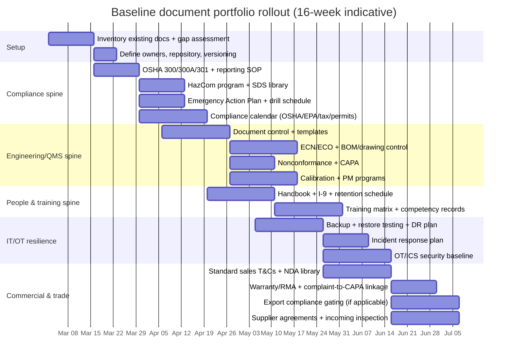

# Baseline Document Portfolio for a Small U.S. Manufacturing Business

## Executive summary

A ~100‑employee U.S. manufacturing company (CEO/COO/CFO with engineering, HR, and sales) needs a document portfolio that does three things concurrently: (1) **preserve corporate authority and decision traceability**, (2) **prove compliance** with safety/environmental, employment, tax, and trade rules, and (3) **operate a repeatable production system** with controlled engineering changes, consistent quality, and secure IT/OT. The “ideal baseline” is therefore not just a set of policies; it is a **managed system of documented information** with owners, approvals, revision control, and training evidence—an approach echoed in ISO quality management guidance on documented information control and flexibility. citeturn3search3turn7search2turn7search6  

Primary regulatory and standards anchors referenced in this report include: entity["organization","U.S. Occupational Safety and Health Administration","us workplace safety regulator"] (recordkeeping and major safety standards), entity["organization","U.S. Environmental Protection Agency","us environmental regulator"] (EPCRA, TRI, SPCC, hazardous waste recordkeeping/reporting), entity["organization","National Institute of Standards and Technology","us standards body"] (CSF 2.0, contingency planning, incident response, OT/ICS security guidance), entity["organization","Bureau of Industry and Security","us export controls bureau"] (EAR and export compliance program guidance), entity["organization","Internal Revenue Service","us tax authority"] (federal tax filing and payroll tax recordkeeping), entity["organization","U.S. Citizenship and Immigration Services","us immigration agency"] (Form I‑9 retention guidance), entity["organization","Federal Trade Commission","us consumer protection agency"] (FCRA background-check compliance), entity["organization","U.S. Department of Labor","us labor department"] (FLSA recordkeeping and ERISA disclosure resources), entity["organization","Employee Benefits Security Administration","us benefits compliance office"] (SPD disclosure guide), entity["organization","U.S. Equal Employment Opportunity Commission","us employment discrimination agency"] (employment recordkeeping baseline), entity["organization","American Institute of Certified Public Accountants","us accounting body"] (internal control/segregation-of-duties implementation tools), entity["organization","Committee of Sponsoring Organizations of the Treadway Commission","internal control framework org"] (internal control model used widely in practice), entity["organization","International Organization for Standardization","global standards body"] (ISO 9001 overview and documented information guidance), entity["organization","International Aerospace Quality Group","as9100 standards body"] (AS9100/9100-series overview), entity["organization","American National Standards Institute","us standards coordination body"] (U.S. consensus standards ecosystem context), and entity["organization","Society of Manufacturing Engineers","us manufacturing association"] (manufacturing body-of-knowledge and lean competency references). citeturn0search4turn1search0turn2search0turn3search2turn4search0turn6search6turn7search2turn7search0turn7search9  

For most manufacturers of this size, the **highest-risk gaps** (and therefore the fastest ROI documents to implement) are:

- **OSHA compliance artifacts**: injury/illness recordkeeping (300/300A/301), severity reporting procedures, hazard communication/SDS system, and high-energy controls (LOTO, confined space where applicable), all of which are explicitly required by OSHA rules/standards. citeturn0search1turn0search8turn0search2turn0search3turn5search2turn5search3  
- **Engineering change control + document control**: a controlled ECN/ECO workflow tied to BOM/drawings/specs so the shop builds the right revision and quality can trace issues effectively—aligned with ISO’s documented information control expectations and common QMS practice. citeturn3search3turn7search2  
- **Export controls** where applicable: a structured export compliance program with training and screening, anchored in BIS’s published “Eight Elements” guidance and EAR enforcement expectations. citeturn2search4turn2search2turn2search1  
- **IT/OT security fundamentals**: CSF‑aligned governance, backups/DR, incident response, and OT security controls appropriate to manufacturing environments. citeturn3search2turn7search3turn2search27  
- **HR compliance recordkeeping**: I‑9 processes, payroll/time records, benefit plan disclosures (SPDs), and compliant background-check workflows where used. citeturn6search1turn4search1turn6search3  

## Portfolio design principles and prioritization method

### How to think about “baseline” for a manufacturing company

Because U.S. requirements are a **federal + state + locality** stack and depend on operations (chemicals, confined spaces, exports, regulated products), an “ideal baseline” for this size should be built around four registers:

- **Regulatory obligations register**: OSHA, EPA/EPCRA, hazardous waste, permits, labor obligations, and any industry/product rules (e.g., consumer product safety, electrical safety, food/medical, aerospace). citeturn0search4turn1search0turn2search1  
- **Quality management system (QMS) documented information**: document control, records control, design/change control, production and inspection records, calibration, maintenance. ISO 9001 explicitly frames documented information as flexible but necessary to demonstrate planning, operation, and control of processes. citeturn3search3turn7search2  
- **Commercial risk controls**: contract templates / terms and conditions, warranty and limitation of liability structure, confidentiality/NDA controls, customer data terms, and export compliance gating in sales order flow. citeturn4search2turn4search3turn2search0  
- **Enterprise risk controls**: cybersecurity governance (CSF 2.0), contingency planning, incident response and escalation, and internal controls for cash disbursements and purchasing. citeturn3search2turn7search3turn3search6  

### Document lifecycle governance (how to avoid “binderware”)

A durable system uses:

- **Single source of truth** (controlled repository) + defined document types: *policy* (what), *procedure* (how), *work instruction/checklist* (how at the point of use), *record* (evidence). ISO’s documented information guidance explicitly permits flexibility but emphasizes that documentation must be adequate to demonstrate effective planning/operation/control. citeturn3search3turn7search6  
- **Approval authorities**: corporate resolutions/board for governance items; CEO/COO/CFO for management system policies; Quality for QMS procedures; EHS for OSHA/EPA programs; HR for employee policies; Legal for contract templates.  
- **Review triggers**: (1) regulatory change, (2) incident/nonconformance, (3) new equipment/process/material, (4) new customer/regulatory market, (5) audit findings (internal/external), and (6) cyber event lessons learned. citeturn0search8turn1search4turn2search2turn3search2  

## Prioritized checklist and playbook for each document

The checklist below is organized by your requested categories. Each entry includes: **purpose; draft/approve; legal/regulatory relevance; recommended contents; minimum vs best practice; typical format; review cadence; priority; template sources**. Where requirements are **state-specific** or **conditional**, it is flagged explicitly.

### Corporate and governance documents

**Articles of Incorporation / Certificate of Formation (corporation) or Certificate of Organization (LLC)** — **Essential**  
Purpose: Establishes the legal entity and core attributes (name, registered agent, structure).  
Draft/approve: Draft by legal counsel/secretary; approved by incorporator/organizer; filed with state; owners/board retain executed copy.  
Legal relevance: State corporate/LLC law (state-specific).  
Contents: entity name, registered agent, share structure or membership structure, purpose, initial directors/managers as applicable.  
Minimum vs best: Minimum = statutorily required fields; Best = harmonized with bylaws/operating agreement and equity documents to avoid governance conflicts.  
Format: state filing + certified copies.  
Review: Amend only when structure changes.  
Templates/sources: state SOS portals (state-specific).

**Bylaws (corporation) / Operating Agreement (LLC)** — **Essential**  
Purpose: Defines governance and decision rules: board/owner meetings, voting, authority, officer roles.  
Draft/approve: Legal + owners/board; approved by board/owners per entity type.  
Legal relevance: State corporate/LLC law; critical for enforcing authority and governance processes.  
Recommended sections: governance structure, officer duties, meetings/quorum/notice, delegations, indemnification, conflicts, amendment process.  
Minimum vs best: Minimum = legally operable rules; Best = explicit delegation-of-authority, signatory thresholds, and written-consent procedures to preserve auditability.  
Format: governance document + adoption resolution.  
Review: Every 1–2 years; after financing/ownership events.  
Templates: counsel templates; industry governance templates.

**Board / Owner meeting minutes + written consents** — **Essential**  
Purpose: Evidence of lawful decision-making for major actions (banking, financing, acquisitions, executive appointments, audits).  
Draft/approve: Corporate secretary drafts; chair approves; stored in corporate minute book.  
Legal relevance: Supports corporate formalities and evidence for disputes, lenders, and auditors.  
Contents: attendees, quorum, agenda, resolutions, votes/consents, approvals.  
Minimum vs best: Minimum = recorded approvals; Best = includes decision rationale for major risk decisions, and attaches exhibits (e.g., authority matrix, capex approvals).  
Format: minutes template.  
Review: Each meeting/action.

**Corporate resolutions (banking, borrowing, signing authority) + Delegation of Authority (DoA) matrix** — **Essential**  
Purpose: Formalizes who can sign what; reduces fraud and contract disputes; enables internal controls.  
Draft/approve: CFO drafts DoA; legal reviews; board/owners approve resolutions; CEO/COO implement.  
Regulatory relevance: Not a regulator requirement, but foundational for control environment, lender/auditor diligence, and prevention of unauthorized commitments.  
Minimum vs best: Minimum = signatory authority list; Best = tiered thresholds by contract type (capex, hiring, PO, sales discounts, export licenses) and dual approvals for high-risk commitments.  
Format: board resolution + matrix.  
Review: Quarterly for personnel changes; annually for thresholds.

### Legal and compliance documents (tax, registrations, permits, OSHA/EPA/EPCRA, export controls, product compliance)

**Corporate tax filings package (federal + state)** — **Essential**  
Purpose: Ensures accurate and timely filing; supports tax positions.  
Draft/approve: CFO/controller + external CPA; CEO approves management representation; owners/board informed.  
Regulatory relevance: Federal corporate returns (e.g., Form 1120 for C‑corps) and state equivalents; e‑filing rules can apply depending on the number of returns filed. citeturn4search0turn4search4  
Minimum vs best: Minimum = accurate timely filings; Best = formal tax calendar, documented tax positions, and retention schedule integrated into record retention.  
Format: tax return binder (digital) + workpapers.  
Review: Annual.

**Payroll tax and employment tax recordkeeping** — **Essential**  
Purpose: Supports payroll tax compliance and audits.  
Draft/approve: Payroll/finance; CFO oversight.  
Regulatory relevance: IRS requires employment tax records be kept at least four years. citeturn4search1turn4search5  
Format: system reports + retention log.  
Review: Ongoing; annual retention audit.

**State registrations and “good standing” file** — **Essential (state-specific)**  
Purpose: Maintain authority to operate; avoid administrative dissolution; support customer/lender onboarding.  
Draft/approve: Legal/ops; CEO/CFO oversight.  
Contents: annual/biennial reports, assumed-name filings, foreign qualifications (if operating in other states).  
Format: filings + confirmations.  
Review: Annual.

**Permits and compliance obligations register** — **Essential**  
Purpose: One authoritative list of all permits/registrations and reporting deadlines (air, stormwater, waste, fire code, building).  
Draft/approve: EHS + ops; COO approves; board receives high-level risk summary.  
Regulatory relevance: Permit requirements are highly state/local and facility-specific; this register is the control mechanism.  
Minimum vs best: Minimum = list of permits + expiration dates; Best = includes operating constraints, required records, and audit evidence owners.  
Format: spreadsheet register + document links.  
Review: Quarterly.

**OSHA injury & illness recordkeeping system (OSHA 300, 300A, 301) + posting procedure** — **Essential (for covered employers)**  
Purpose: Maintain required logs and demonstrate compliance readiness.  
Draft/approve: EHS or HR/EHS; COO approves; CEO signs annual summary where required.  
Regulatory relevance: OSHA provides the official forms; retention is five years; annual summary posting is required Feb 1–Apr 30; severe injury/fatality reporting has strict timeframes. citeturn0search1turn5search12turn5search1turn0search8turn0search0  
Minimum vs best:  
- Minimum = accurate logs + posted 300A + retained records  
- Best = integrates near-miss trend analysis, corrective actions, and management review  
Format: OSHA fillable PDFs or EHS system + posting checklist. citeturn0search1turn5search1  
Review: Continuous; annual certification and posting.

**Severe incident reporting SOP (OSHA 1904.39 reporting)** — **Essential**  
Purpose: Ensures the business reports fatalities and severe injuries within required windows and preserves scene integrity.  
Draft/approve: EHS drafts; COO approves; legal reviews escalation protocol.  
Regulatory relevance: Fatalities must be reported within 8 hours and inpatient hospitalization/amputation/eye loss within 24 hours (with additional timing conditions). citeturn0search8turn0search0  
Format: checklist + call tree + incident form.  
Review: Annual and after any reportable event.

**Hazard Communication Program (written HazCom program + SDS library + labeling + training records)** — **Essential if hazardous chemicals are present**  
Purpose: Ensures workers understand chemical hazards; central compliance binder for chemical safety.  
Draft/approve: EHS drafts; COO approves; supervisors implement training.  
Regulatory relevance: OSHA’s HCS (29 CFR 1910.1200) requires a hazard communication program; OSHA guidance highlights labels, SDSs, and training with a written program describing how requirements are met. citeturn0search2turn0search6  
Minimum vs best:  
- Minimum = written program + SDS availability + training upon assignment and when new hazards introduced  
- Best = electronic SDS access, chemical inventory integration, and periodic refresher training with audits  
Format: written program template + SDS repository + training attendance log. citeturn0search6  
Review: At least annually; immediately with new chemicals/processes.

**Lockout/Tagout (LOTO) program + machine-specific procedures + training + periodic inspections** — **Essential if servicing/maintenance exposes workers to hazardous energy**  
Purpose: Prevent unintended energization; controls one of the highest-severity manufacturing risks.  
Draft/approve: EHS/maintenance drafts; COO approves; supervisors enforce.  
Regulatory relevance: OSHA 29 CFR 1910.147 requires specific energy control procedures and procedural steps (shutdown/isolation, lock placement/removal responsibilities, verification testing). citeturn0search3turn0search15  
Minimum vs best: Minimum = written procedures and training; Best = machine-specific LOTO sheets, periodic procedure audits, and contractor LOTO coordination.  
Format: procedure template + machine sheets + inspection checklist.  
Review: Annual or when equipment changes.

**Permit-required confined space program + permits + rescue plan** — **Conditional (Essential if permit spaces exist and entry occurs)**  
Purpose: Controls confined space entry, atmospheric testing, rescue readiness.  
Draft/approve: EHS drafts with maintenance; COO approves; legal reviews rescue contracting terms.  
Regulatory relevance: If employees enter permit spaces, employer must develop and implement a written permit space program, available for employee inspection. citeturn5search3turn5search15  
Format: written program + entry permit template + rescue drill logs.  
Review: Annual; after any entry incident.

**Emergency Action Plan (EAP) + drills and training** — **Essential (most manufacturing sites)**  
Purpose: Organizes actions in emergencies (fire, chemical release, severe weather).  
Draft/approve: EHS/ops drafts; COO approves.  
Regulatory relevance: OSHA 1910.38 requires an EAP in writing (with certain small-employer exceptions) and specifies minimum required elements (e.g., reporting fire/emergency procedures). citeturn5search2turn5search6  
Format: plan template + drill checklist.  
Review: Annual; after facility/layout changes.

**EPCRA Sections 311–312 program (SDS submission/list + annual Tier II chemical inventory process)** — **Conditional (Essential if thresholds met)**  
Purpose: Community right-to-know compliance and emergency planning support for hazardous chemicals.  
Draft/approve: EHS drafts; COO approves; legal ensures correct jurisdiction filings.  
Regulatory relevance: EPA describes that facilities must maintain SDSs and submit SDS or list of hazardous chemicals to designated agencies; Tier II forms are submitted annually with prior-year data due by March 1. citeturn1search0turn1search4  
Format: procedure + chemical inventory + Tier II submission evidence.  
Review: Annual (Tier II cycle) + continuous inventory updates.

**TRI (EPCRA Section 313) reporting workpapers + submission evidence** — **Conditional (Essential if criteria met)**  
Purpose: Annual toxic chemical release reporting and documentation.  
Draft/approve: EHS drafts with operations; COO approves; legal reviews; CFO aware due to potential liabilities.  
Regulatory relevance: EPA states TRI data is due July 1 each year for covered facilities meeting reporting criteria. citeturn1search21turn1search5  
Format: calculation workbook + submission confirmation.  
Review: Annual.

**Hazardous waste management program (RCRA generator status determination, manifests, recordkeeping)** — **Conditional (Essential if hazardous waste generated)**  
Purpose: Tracks waste from generation to disposal and maintains required evidence.  
Draft/approve: EHS drafts; COO approves.  
Regulatory relevance: EPA describes hazardous waste manifest system for tracking; hazardous waste generator recordkeeping and reporting requirements are codified and states may be more stringent. citeturn1search6turn1search2turn1search18  
Format: waste procedures + manifests + training records.  
Review: Annual; when processes change.

**SPCC Plan (Spill Prevention, Control, and Countermeasure)** — **Conditional (Essential if storing oil above applicability thresholds)**  
Purpose: Prevent oil discharges; defines controls, inspections, spill response.  
Draft/approve: EHS drafts (often with qualified engineer depending on facility conditions); COO approves; keep onsite.  
Regulatory relevance: EPA states SPCC rule requires owner/operator to prepare and implement an SPCC Plan and maintain it at the facility. citeturn1search11turn1search15  
Format: plan + inspection logs.  
Review: As required by rule and upon facility changes.

**Export compliance program (ECP/ICP) + screening + classification + recordkeeping** — **Conditional (Essential if exporting, re-exporting, or shipping controlled items/technology)**  
Purpose: Prevent unauthorized exports and avoid severe penalties; standardizes classification, license determination, and recordkeeping.  
Draft/approve: Trade compliance officer + legal drafts; CEO/COO approves; sales operations implements gating.  
Regulatory relevance: EAR purpose described; BIS publishes Export Compliance Guidelines including Eight Elements; penalties can be criminal and administrative with published maximums. citeturn2search1turn2search4turn2search2  
Recommended contents: management commitment; risk assessment; export authorization process (ECCN/CCL classification); restricted party screening; recordkeeping; training; audits; corrective actions (elements align to BIS guidance). citeturn2search4  
Format: program manual + checklists embedded in order-to-cash.  
Review: Semiannual; immediately after rule changes or violations.

**Product compliance file / regulatory matrix** — **Important (may become Essential based on product/industry)**  
Purpose: Shows product meets applicable statutory/regulatory and customer requirements (marking, labeling, safety, materials restrictions, sector rules).  
Draft/approve: Engineering + quality draft; COO approves; legal reviews claims; sales uses in customer responses.  
Regulatory relevance: Highly product-dependent; treat as a “compliance design input” and maintained evidence set (test reports, certificates).  
Minimum vs best: Minimum = product regulatory applicability matrix + required declarations; Best = full technical file with traceable requirements, test plans/reports, change impact assessment gates in ECN flow.  
Format: matrix + evidence binder.  
Review: At least annually and per product change.

### HR documents and employment records

**Employee handbook (including EEO/harassment, safety responsibilities, conduct)** — **Essential**  
Purpose: Sets policies and provides consistent expectations; supports discipline and legal defense.  
Draft/approve: HR drafts; legal reviews; CEO approves; managers trained.  
Regulatory relevance: State-heavy; also intersects with OSHA training and incident reporting duties in EHS programs.  
Format: handbook template + acknowledgment forms.  
Review: At least annually; whenever state/local laws change materially.

**Job descriptions (all roles) + essential functions / physical demands** — **Essential**  
Purpose: Hiring clarity, performance management, ADA accommodation discussions, training requirements mapping.  
Draft/approve: HR drafts with department heads; CEO/COO approve.  
Format: standardized template.  
Review: Annual; when roles change.

**Offer letter templates + onboarding package** — **Essential**  
Purpose: Consistent employment terms, IP/confidentiality acknowledgments, policy acknowledgments.  
Draft/approve: HR + legal; CEO approves.  
Review: Annual.

**Background check policy + FCRA disclosure/authorization + adverse action process** — **Important (Essential for certain roles)**  
Purpose: Standardizes screening and ensures legal compliance when using consumer reports.  
Draft/approve: HR drafts; legal reviews; CEO approves.  
Regulatory relevance: FTC guidance emphasizes employers must comply with FCRA when using consumer reports for employment decisions. citeturn6search3  
Minimum vs best: Minimum = clear disclosure + written consent + adverse action notices; Best = documented job-related decision criteria and audit trail. citeturn6search3turn6search7  
Format: policy + standalone forms + workflow checklist.  
Review: Annual.

**Form I‑9 process + retention tracker** — **Essential (U.S. employers)**  
Purpose: Employment eligibility verification and compliance evidence.  
Draft/approve: HR owns; CEO accountable.  
Regulatory relevance: USCIS handbook provides retention rules (3 years after hire or 1 year after termination, whichever later). citeturn2search0  
Format: process checklist + audit log.  
Review: Annual internal audit.

**Payroll/timekeeping records + retention schedule** — **Essential**  
Purpose: Wage/hour compliance evidence.  
Draft/approve: Payroll/HR; CFO oversight.  
Regulatory relevance: DOL FLSA recordkeeping rules require keeping payroll and hours-related records. citeturn2search1  
Format: system records + retention policy.  
Review: Annual retention audit.

**Benefits plan documents + Summary Plan Descriptions (SPDs) + Summary of Material Modifications (SMMs)** — **Important (Essential if ERISA-covered benefit plans exist)**  
Purpose: Required disclosure of benefits, rights, and obligations.  
Draft/approve: Benefits/HR with broker/TPA; legal reviews; CFO approves.  
Regulatory relevance: DOL’s reporting/disclosure guide describes SPD as primary disclosure; 29 CFR 2520.102‑3 sets SPD content requirements; new employees must receive SPD within required timeframe (e.g., within 90 days after becoming covered) per IRS retirement plan guidance and DOL rules. citeturn6search6turn6search1turn6search2  
Format: plan document + SPD PDFs + distribution tracking.  
Review: At least annually; on plan changes.

**Performance review process + templates + calibration guidance** — **Important**  
Purpose: Consistent evaluation; supports merit decisions and defensible terminations.  
Draft/approve: HR drafts; CEO approves.  
Format: template + manager guide + schedule.  
Review: Annual cycle.

**Training records (HR compliance + EHS training) + retention policy** — **Essential**  
Purpose: Evidence that required training occurred (HazCom, LOTO, forklift, etc.).  
Draft/approve: HR/EHS maintain; COO oversight.  
Regulatory relevance: Many OSHA programs require training; OSHA HazCom guidance explicitly includes training as a required program component. citeturn0search6  
Format: training matrix + attendance logs + competency sign‑offs.  
Review: Quarterly.

**Employment records retention policy** — **Important**  
Purpose: Prevents premature destruction; supports EEOC and other requirements.  
Regulatory relevance: EEOC regulations require certain employment records retention (baseline one year; longer in some cases). citeturn4search25  
Format: retention schedule integrated with broader records policy.  
Review: Annual.

### Engineering and operations (design control, ECN, BOM, drawings/CAD, quality, SOPs, maintenance, calibration, supplier)

**Document control procedure (revision control + approvals + distribution + obsolete prevention)** — **Essential**  
Purpose: Ensures shop floor uses the correct revision; prevents “shadow documents.”  
Draft/approve: Quality manager drafts; COO approves; engineering and production trained.  
Standards relevance: ISO provides guidance on documented information flexibility and emphasizes appropriate documented information to demonstrate planning and control; ISO 9001 overview describes QMS requirements and continuous improvement. citeturn3search3turn7search2  
Minimum vs best: Minimum = approval before release + versioning + controlled distribution; Best = role-based access, electronic workflows, and audit trails tied to training acknowledgments.  
Format: procedure + document template controls.  
Review: Annual.

**Design control procedure (design inputs/outputs, reviews, verification/validation, design transfer)** — **Important (Essential if you design products or certify to ISO/AS standards)**  
Purpose: Prevents quality escapes by formalizing how requirements become producible specs.  
Draft/approve: Engineering + quality draft; COO approves.  
Standards relevance: ISO 9001 is used to demonstrate ability to consistently provide products meeting customer/regulatory requirements; aerospace 9100 standard is explicitly a QMS requirements standard for aviation/space/defense supply chains. citeturn7search2turn3search1turn3search8  
Minimum vs best: Minimum = gated design reviews and approved outputs; Best = risk-based design FMEA linkage and formal design transfer packages (PFMEA/control plan/WIs).  
Format: procedure + checklists.  
Review: Per program; procedure annually.

**Engineering Change Notice (ECN/ECO) process + Change impact assessment + effectivity control** — **Essential**  
Purpose: Controls changes to drawings/BOM/specs/work instructions; ensures correct change rollout and traceability.  
Draft/approve: Engineering drafts; quality reviews; operations approves; CFO reviews cost impacts as needed.  
Minimum vs best: Minimum = change request → review → approval → implementation → verification; Best = includes regulatory/customer notification triggers, inventory disposition, and traceability/serialization rules.  
Format: ECN template + workflow checklist.  
Review: Continuous; procedure annual.

**BOM governance and master data policy (ERP/MRP)** — **Essential**  
Purpose: Prevents build errors; drives costing and planning accuracy.  
Draft/approve: Engineering + supply chain + finance; COO approves.  
Minimum vs best: Minimum = controlled BOM ownership and revision; Best = change audit trails, approved alternates rules, and linkage to supplier quality.  
Format: SOP + ERP work instruction.  
Review: Quarterly.

**Drawings, CAD, and technical data management policy (PDM/PLM)** — **Essential**  
Purpose: Controls CAD files, drawing revisions, and access to technical data (including export-controlled technical data where applicable).  
Draft/approve: Engineering + IT + export compliance; COO approves.  
Regulatory relevance: If export-controlled technical data exists, protect access and adopt technology control measures as part of export compliance program. citeturn2search4turn2search1  
Format: procedure + access control rules.  
Review: Semiannual.

**Product specification, labeling, and configuration baseline (Requirements + spec control)** — **Important**  
Purpose: “Single source” for what the product is and how it is verified.  
Draft/approve: Engineering drafts; quality approves; COO signs.  
Best practice: tie to incoming inspection criteria, in-process checks, and final acceptance tests.  
Format: specification templates + acceptance test checklist.  
Review: With each revision; annual meta-review.

**Quality Manual / QMS overview (scope, processes, policies)** — **Important (often Essential if ISO 9001 certification or key customer requirements)**  
Purpose: Defines QMS scope and process map; demonstrates compliance to customer and regulatory expectations.  
Draft/approve: Quality drafts; COO approves; CEO sponsors.  
Standards relevance: ISO 9001 sets QMS requirements to consistently meet customer and regulatory requirements and improve. citeturn7search2turn7search6  
Format: manual + process map.  
Review: Annual management review.

**SOP library and Work Instructions (WIs) / shop travelers** — **Essential**  
Purpose: Standardized methods, training, and repeatability; reduces scrap and safety incidents.  
Draft/approve: Process engineering/production drafts; quality approves; COO owns.  
Format: SOP templates + WI checklists.  
Review: At least annually; when process changes.

**Incoming inspection procedure + sampling plan + records** — **Important (often Essential depending on supplier risk)**  
Purpose: Prevents defective material from entering production; supports traceability and supplier corrective action.  
Draft/approve: Quality drafts; COO approves.  
Format: checklist + inspection report form.  
Review: Quarterly.

**Nonconforming material procedure (NCMR) + MRB disposition forms** — **Essential**  
Purpose: Controls defects, quarantine, disposition (rework, scrap, use-as-is), and traceability to corrective action.  
Draft/approve: Quality drafts; COO approves; engineering disposition authority defined.  
Format: procedure + NCMR form.  
Review: Annual.

**CAPA procedure (corrective and preventive action) + root cause templates** — **Essential**  
Purpose: Systemic fix and recurrence prevention based on nonconformances, customer complaints, near-misses.  
Draft/approve: Quality drafts; COO approves.  
Format: CAPA form + 8D/A3 templates.  
Review: Annual; after major escape.

**Supplier/vendor contracts and supplier quality agreements (SQAs)** — **Important**  
Purpose: Defines specs, inspections, right-to-audit, change notification, warranty, and flow-down requirements; mitigates supply chain risk.  
Draft/approve: Supply chain drafts; legal + quality review; CFO approves depending on spend.  
Format: master services agreement + PO Ts&Cs + SQA template.  
Review: Annual for templates; per supplier for updates.

**Preventive maintenance (PM) program + PM schedules + completion logs** — **Essential**  
Purpose: Prevents downtime, improves safety, supports consistent process capability.  
Draft/approve: Maintenance drafts; COO approves.  
Format: CMMS plan + PM checklists.  
Review: Monthly metrics; annual plan.

**Calibration/Metrology program (gage control) + calibration records** — **Essential**  
Purpose: Ensures measurement integrity; supports acceptance decisions and audits.  
Draft/approve: Quality/metrology drafts; COO approves.  
Format: calibration schedule + certificates + out-of-tolerance procedure.  
Review: Continuous; annual program audit.

### Accounting and finance documents

**Chart of Accounts (CoA) + account mapping** — **Essential**  
Purpose: Consistent financial reporting (COGS, inventory, labor absorption, overhead).  
Draft/approve: Controller drafts; CFO approves.  
Format: list + mapping.  
Review: Annual; when product lines change.

**Accounting policies manual (rev rec policy, inventory costing, close rules, accruals)** — **Important**  
Purpose: Standardizes close and reduces audit risk.  
Draft/approve: Controller drafts; CFO approves.  
Format: policy manual.  
Review: Annual.

**Internal controls framework + segregation-of-duties matrix + control owners** — **Essential**  
Purpose: Prevent/Detect errors and fraud in purchasing, payables, payroll, inventory, and cash receipts.  
Draft/approve: CFO drafts; CEO approves; board/owners review.  
Best practice sources: AICPA provides segregation-of-duties reference charts; COSO is widely used to structure control objectives (operations/reporting/compliance). citeturn3search6turn3search29  
Format: matrix + procedures + compensating controls list.  
Review: Quarterly (controls) + annual testing.

**Procurement policy + purchasing authority + three-way match procedures** — **Essential**  
Purpose: Spend control and traceability; reduces vendor fraud risk.  
Draft/approve: CFO + supply chain; CEO approves.  
Format: policy + checklist.  
Review: Annual; after fraud findings.

**Expense policy and travel policy** — **Important**  
Purpose: Controls reimbursement, per diem, approvals, and audit trail.  
Draft/approve: CFO drafts; CEO approves.  
Format: policy template + expense report form.  
Review: Annual.

**Fixed asset register + capitalization policy + depreciation schedules** — **Essential**  
Purpose: Accurate financial statements and tax alignment; supports insurance values and theft controls.  
Draft/approve: Controller drafts; CFO approves.  
Format: register spreadsheet + policy.  
Review: Quarterly updates; annual review.

**Month-end close checklist + reconciliations binder** — **Essential**  
Purpose: Close consistency and reliability; reduces key-person dependence.  
Draft/approve: Controller drafts; CFO approves.  
Format: checklist.  
Review: Monthly.

**Financial reporting package (monthly) + board/owner reporting** — **Important**  
Purpose: Management visibility to margin, on-time delivery metrics, working capital, and safety/quality KPIs.  
Draft/approve: CFO drafts; CEO reviews.  
Format: deck + KPI dashboard.  
Review: Monthly.

**Audit workpapers binder (if audited or reviewed) + management representation support** — **Optional (important if lender/customer requires)**  
Purpose: Efficient audits and lender compliance.  
Draft/approve: CFO/controller.  
Format: binder.  
Review: Annual.

**Tax provision file (ASC 740) and uncertain tax positions memo** — **Optional (important if GAAP reporting or audits)**  
Purpose: Supports financial reporting accuracy.  
Draft/approve: CFO + tax advisor.  
Review: Annual.

### Safety and environmental documents (EHS)

**EHS policy statement + responsibilities** — **Essential**  
Purpose: Sets expectations and accountability for safety and environment.  
Draft/approve: EHS drafts; CEO/COO approve.  
Format: policy statement.  
Review: Annual.

**PPE hazard assessment + PPE policy + training** — **Important (often Essential depending on facility hazards)**  
Purpose: Ensures PPE selection based on hazard assessment; supports training requirements.  
Draft/approve: EHS drafts; COO approves.  
Format: assessment checklist + policy.  
Review: Annual; when hazards change.

**Incident investigation procedure + incident report form + near-miss log** — **Essential**  
Purpose: Creates consistent reporting and root cause; prevents recurrence.  
Regulatory relevance: Integrates with OSHA reportable event requirements and recordkeeping. citeturn0search8turn5search0  
Format: form + workflow.  
Review: Quarterly trend reviews; annual procedure review.

**Emergency response and spill response plan** — **Important (often Essential)**  
Purpose: Defines response to fires, chemical spills, injuries.  
Regulatory relevance: ties to OSHA EAP and (where applicable) EPA SPCC. citeturn5search2turn1search11  
Format: plan + drill records.  
Review: Annual and after drills/incidents.

### IT and security (including OT/ICS security)

**Acceptable Use Policy (AUP)** — **Essential**  
Purpose: Sets expectations for corporate IT use, data handling, and prohibited activities.  
Draft/approve: IT + HR; CEO approves.  
Format: policy + acknowledgment.  
Review: Annual.

**Access control policy (joiner/mover/leaver process) + privileged access controls** — **Essential**  
Purpose: Prevents unauthorized access and reduces insider risk.  
Draft/approve: IT drafts; COO approves.  
Format: procedure + checklist.  
Review: Quarterly.

**Backup policy + restoration testing evidence** — **Essential**  
Purpose: Data recoverability; ransomware resilience.  
Standards relevance: NIST contingency planning guidance addresses process and format for contingency planning; CSF 2.0 includes Recover outcomes. citeturn7search3turn3search2  
Format: policy + test logs.  
Review: Quarterly tests; annual policy.

**Disaster Recovery (DR) / Business Continuity Plan (BCP)** — **Important**  
Purpose: Restores operations after disruption; prioritizes ERP/MRP, CAD/PDM, email, shop floor systems.  
Standards relevance: NIST SP 800‑34 focuses on contingency planning purpose/process/format. citeturn7search3turn7search7  
Format: plan + tabletop exercises.  
Review: Annual; after major system changes.

**Security incident response plan + incident log** — **Important**  
Purpose: Defines detection, triage, containment, communications, and recovery.  
Standards relevance: NIST incident handling guidance outlines incident handling lifecycle approach. citeturn2search11  
Format: playbook + contact list.  
Review: Semiannual tabletop.

**OT/ICS security program (network segmentation, remote access controls, patching strategy)** — **Important (often Essential where OT exists)**  
Purpose: Protects operational technology and safety-critical control environments.  
Standards relevance: NIST SP 800‑82 provides OT security guidance with attention to performance/reliability/safety requirements. citeturn2search27turn2search3  
Format: policy + architecture diagrams + control checklists.  
Review: Quarterly.

### Sales and customer documents

**Sales contract templates + standard terms and conditions (T&Cs)** — **Essential**  
Purpose: Controls liability, warranty, delivery, payment, IP/confidentiality, and dispute resolution.  
Draft/approve: Legal drafts; CEO approves; sales trained.  
Regulatory relevance: UCC Article 2 governs sale of goods in states (adopted with variations); warranty disclaimers must be conspicuous and mention merchantability in certain cases; limitation of consequential damages is generally allowable in commercial settings unless unconscionable. citeturn4search2turn4search3  
Format: contract template + clause library.  
Review: Annual; after major claims.

**NDA / confidentiality agreement template (customer + supplier + employee inventions/know-how)** — **Essential**  
Purpose: Protects proprietary information and supports trade secret protections (reasonable measures).  
Draft/approve: Legal drafts; CEO approves.  
Legal relevance: Federal trade secret civil action statute provides a cause of action for misappropriation relating to products/services used in interstate/foreign commerce; NDAs are a core “reasonable measure.” citeturn6search0  
Format: NDA template + intake checklist.  
Review: Annual.

**Warranty terms + warranty disclaimer strategy + RMA/returns process** — **Important (often Essential if product returns occur)**  
Purpose: Standardizes warranty obligations and return authorization; links to corrective action and product improvements.  
Legal relevance: UCC warranty disclaimer rules influence enforceability (conspicuousness, merchantability reference). citeturn4search2  
Format: warranty statement + RMA SOP + forms.  
Review: Annual and based on warranty data.

**Customer complaint handling + escalation + CAPA linkage** — **Essential**  
Purpose: Prevents repeat defects and manages customer trust; ties field failures to root cause and design/process changes.  
Format: SOP + complaint log + CAPA trigger thresholds.  
Review: Monthly trending; annual SOP review.

**Customer data and privacy policy (B2B data handling, portals, cybersecurity expectations)** — **Important**  
Purpose: Defines data categories, retention, security controls, breach notification process.  
Standards relevance: NIST CSF 2.0 provides a taxonomy for governance and risk outcomes and can be used to structure cybersecurity controls. citeturn3search2turn3search9  
Format: policy + data map.  
Review: Annual; when systems change.

**Sales/export compliance gating (screening, end-use/end-user, shipment holds)** — **Conditional (Essential if exports/foreign customers)**  
Purpose: Prevents prohibited sales/shipments and ensures license/exception checks.  
Regulatory relevance: BIS export compliance guidelines and penalties guidance support implementing a risk-based compliance program and screening controls. citeturn2search4turn2search2turn2search0  
Format: checklist embedded in CRM/ERP + evidence logs.  
Review: Quarterly.

### Training and competency documents

**Training matrix (role × required training) + onboarding plan** — **Essential**  
Purpose: Ensures job competence and required training; simplifies audits; reduces safety incidents.  
Standards relevance: Manufacturing competency frameworks and lean body-of-knowledge references exist via industry associations; use them as optional alignment aids. citeturn7search1turn7search25  
Format: matrix spreadsheet + onboarding checklists.  
Review: Quarterly.

**Skills and certifications records (forklift, weld certs, inspection certs, etc.)** — **Important**  
Purpose: Proves qualification for tasks and high-risk equipment.  
Format: records + expiration alerts.  
Review: Monthly (expirations).

### Risk and compliance management documents

**Enterprise risk register (safety, quality, supply chain, cyber, financial, compliance)** — **Important**  
Purpose: Creates prioritized risk view and mitigation ownership.  
Standards relevance: NIST CSF’s Govern function emphasizes cybersecurity governance as part of risk management; use risk register to integrate cyber and operational risks. citeturn3search2turn3search9  
Format: register + mitigation plans.  
Review: Quarterly.

**Insurance certificates + policy summaries + renewal calendar** — **Essential**  
Purpose: Contract readiness and loss management; evidence for customers and landlords.  
Format: binder.  
Review: Annual.

**Compliance calendar (OSHA/EPA reporting, tax deadlines, training renewals, permit renewals)** — **Essential**  
Purpose: Prevents missed filings (e.g., Tier II by March 1 where applicable; TRI by July 1 where applicable; OSHA 300A posting window), and schedules internal reviews. citeturn1search4turn1search21turn5search1  
Format: calendar + checklist.  
Review: Monthly monitoring; quarterly governance review.

## Minimum vs best-practice comparison for the top 25 documents

The table below focuses on the documents with the largest effect on compliance, operational reliability, and commercial risk for a 100‑employee manufacturer.

| Document | Minimum contents | Best-practice contents | Review |
|---|---|---|---|
| Articles/formation filing | State-required fields | Harmonized with governance + equity documents | As needed |
| Bylaws/operating agreement | Governance basics, authority | Delegation thresholds, written consent rules, indemnification + dispute clarity | 1–2 yrs |
| Minutes + written consents | Decisions recorded | Decision rationale + exhibits for major approvals | Each action |
| Signing authority + DoA matrix | Authorized signers | Tiered thresholds, dual approvals, system-enforced approvals | Quarterly |
| Permit/compliance register | List of permits | Constraints, evidence owners, audit links, renewal alerts | Quarterly |
| OSHA 300/300A/301 program | Logs + 300A posting + retention citeturn5search12turn5search1 | Trend analytics + corrective actions + internal audits | Continuous |
| Severe incident reporting SOP | Timeframes + call tree citeturn0search8turn0search0 | Scene control + legal escalation + root-cause integration | Annual |
| Hazard communication program | Written program + SDS + training citeturn0search6turn0search2 | Digital SDS + chemical inventory + refresher audits | Annual |
| LOTO program | Procedures + training citeturn0search3turn0search15 | Machine-specific sheets + periodic inspections | Annual |
| Confined space program (if applicable) | Written program + permits citeturn5search3turn5search15 | Rescue drills + multi-employer coordination | Annual |
| Emergency Action Plan | Written EAP elements citeturn5search2turn5search6 | Drills + lessons learned + integrated spill response | Annual |
| EPCRA Tier II process (if applicable) | SDS/list + annual submission evidence citeturn1search0turn1search4 | Automated chemical inventory, thresholds monitoring | Annual |
| TRI reporting file (if applicable) | Workpapers + submission evidence citeturn1search21 | Controls around data sources + management certification | Annual |
| SPCC plan (if applicable) | Plan + onsite copy citeturn1search11turn1search15 | Inspection logs + secondary containment checks | As required |
| Export compliance program (if applicable) | ECP basics + screening citeturn2search4turn2search1 | 8-element program + audits + corrective actions | Semiannual |
| Employee handbook | Core policies | State addenda + training + acknowledgments | Annual |
| FCRA background-check package | Disclosure + authorization + adverse action steps citeturn6search3turn6search7 | Job-related criteria + adverse action evidence log | Annual |
| I‑9 process + retention | Completion + retention rules citeturn2search0 | Periodic internal audits + secure storage | Annual |
| Payroll/timekeeping records | Required data retained citeturn2search1turn4search1 | Central retention schedule + audit trail | Annual |
| Benefits/SPD package (if applicable) | SPD content + distribution evidence citeturn6search1turn6search6 | Change control with SMMs + request response workflow | Annual |
| Document control procedure | Approvals + revision + distribution citeturn3search3turn7search2 | Electronic workflows + training linkage + audit records | Annual |
| ECN/ECO process | Change request/approval | Impact assessment (quality/regulatory/inventory), effectivity + traceability | Annual |
| BOM/drawing/CAD governance | Ownership + revision rules | PLM/PDM security + export tech controls + access governance | Semiannual |
| Calibration program | Schedule + certs | Out-of-tolerance workflow + gage R&R linkage | Annual |
| Financial internal controls | Approval thresholds | Segregation-of-duties matrix + compensating controls + testing citeturn3search6 | Quarterly |

## Implementation roadmap with timeline and responsible roles

### Recommended rollout sequencing for a 100‑employee manufacturer

Assuming you have *some* documents today but want an “ideal baseline,” prioritize in the order that reduces regulatory exposure and production escapes first, then mature finance/IT and commercial controls.

**Phase definition (indicative):**

- **Phase 1 (Weeks 1–3): Compliance spine** — OSHA recordkeeping/reporting, HazCom/SDS, EAP; build compliance calendar; assign document owners. citeturn0search1turn0search8turn0search6turn5search2  
- **Phase 2 (Weeks 4–8): Engineering/QMS spine** — document control, ECN/ECO, BOM/drawing control, nonconformance/CAPA, calibration, PM. citeturn3search3turn7search2  
- **Phase 3 (Weeks 6–10): HR & training spine** — handbook updates, I‑9, retention schedules, training matrix and competency evidence. citeturn2search0turn2search1turn4search1  
- **Phase 4 (Weeks 8–14): IT/OT resilience** — backups/DR, incident response, OT security controls. citeturn3search2turn7search3turn2search27  
- **Phase 5 (Weeks 10–16): Commercial and trade** — contracts library (T&Cs, NDA), warranty/RMA, export compliance gating (if applicable), supplier agreements. citeturn4search2turn4search3turn2search4  

### Role accountability (who leads what)

- **Board/Owners**: approve governance documents; review major risk posture and capital commitments (via DoA and board resolutions).  
- **CEO**: sponsor tone and approve enterprise policies (code of conduct, major compliance programs, export compliance policy if applicable).  
- **COO**: owner of EHS, production system, and QMS implementation; ensures procedures exist and are used at the point of work.  
- **CFO**: owner of finance controls, tax/filings, procurement and spend controls, and retention schedules for financial/tax records. citeturn4search1turn4search0  
- **HR**: owner of handbook, I‑9, hiring packet, training matrix, benefits disclosures coordination. citeturn2search0turn6search6  
- **Engineering**: owner of design control, technical data control, ECN/ECO, specifications and configuration baseline.  
- **Quality**: owner of document control, nonconformance/CAPA, calibration, inspection records, supplier quality systems.  
- **Legal**: owner/reviewer of contract templates, warranty/limitation clauses, export compliance escalation, and litigation hold.  

## Visual aids



```mermaid
flowchart TD
A[Need identified: regulation change, incident, audit finding, new product] --> B[Assign document owner]
B --> C[Draft or revise document + forms/checklists]
C --> D[Functional review: affected departments]
D --> E{Regulatory/legal review needed?}
E -->|Yes| F[Legal/EHS/Quality review and revisions]
E -->|No| G[Finalize draft]
F --> G
G --> H{Policy-level (enterprise) or contract template?}
H -->|Yes| I[CEO/COO/CFO approval or board/owners if governance]
H -->|No| J[Function leader approval (e.g., Quality/EHS/IT)]
I --> K[Publish controlled revision + train + collect sign-offs]
J --> K
K --> L[Update training matrix and compliance calendar]
L --> M[Periodic review and audit]
```

## Sample language snippets for critical clauses

These snippets are **illustrative starting points** and should be reviewed by counsel and aligned to your products, customer profile (B2B vs consumer), and state law variations.

### Limitation of liability (B2B sales)

> “IN NO EVENT SHALL SELLER BE LIABLE FOR ANY INDIRECT, SPECIAL, INCIDENTAL, OR CONSEQUENTIAL DAMAGES… SELLER’S TOTAL LIABILITY SHALL NOT EXCEED THE AMOUNT PAID FOR THE PRODUCTS GIVING RISE TO THE CLAIM.”

Legal foundation note: UCC 2‑719 explicitly contemplates limiting or excluding consequential damages unless unconscionable; commercial limitations are generally treated differently than consumer injury contexts. citeturn4search3  

Typical format: clause library entry in standard T&Cs.  
Review: Annual; after major claims.

### Warranty disclaimer (implied warranties)

> “EXCEPT AS EXPRESSLY STATED, SELLER DISCLAIMS ALL IMPLIED WARRANTIES, INCLUDING MERCHANTABILITY AND FITNESS FOR A PARTICULAR PURPOSE, TO THE EXTENT PERMITTED BY LAW.”

Legal foundation note: UCC 2‑316 requires that disclaimers of implied warranty of merchantability mention “merchantability” and be conspicuous when in writing; fitness disclaimers must be in writing and conspicuous. citeturn4search2  

Typical format: warranty section in T&Cs and quote/order acknowledgment.  
Review: Annual; update if product law triggers.

### Confidentiality / NDA

> “Recipient shall protect Confidential Information using at least reasonable care, may use it only for the Permitted Purpose, and may disclose it only to personnel with a need to know who are bound by confidentiality obligations.”

Legal foundation note: Federal trade secret law provides a civil cause of action for misappropriation and underscores the importance of protective measures; NDAs are a common cornerstone of demonstrating reasonable measures. citeturn6search0  

Typical format: short-form NDA + mutual NDA variant + data room rules.  
Review: Annual; after any leakage incident.

### Safety incident reporting clause (internal policy / handbook)

> “Employees must immediately report any work-related injury, illness, near-miss, or property damage to their supervisor and EHS. EHS will determine OSHA recordability and whether OSHA notification is required.”

Regulatory anchor: OSHA requires reporting fatalities within 8 hours and inpatient hospitalization/amputation/eye loss within 24 hours, with additional timing rules; integrating this into internal reporting reduces missed notifications. citeturn0search8turn0search0  

Typical format: EHS policy + incident form + call tree.  
Review: Annual; after each severe incident.

## Primary sources and reputable template links

To satisfy “links to primary sources,” URLs are listed plainly in a code block; citations throughout the report also link directly to many of these.

```text
OSHA (recordkeeping, HazCom, LOTO, EAP, confined space)
- https://www.osha.gov/recordkeeping/forms
- https://www.osha.gov/report
- https://www.osha.gov/laws-regs/regulations/standardnumber/1904/1904.33
- https://www.osha.gov/laws-regs/regulations/standardnumber/1904/1904.32
- https://www.osha.gov/laws-regs/regulations/standardnumber/1910/1910.1200
- https://www.osha.gov/laws-regs/regulations/standardnumber/1910/1910.147
- https://www.osha.gov/laws-regs/regulations/standardnumber/1910/1910.38
- https://www.osha.gov/laws-regs/regulations/standardnumber/1910/1910.146
- https://www.osha.gov/sites/default/files/publications/OSHA3696.pdf

EPA (EPCRA, Tier II, TRI, hazardous waste, SPCC)
- https://www.epa.gov/epcra/hazardous-chemical-inventory-reporting
- https://www.epa.gov/epcra/epcra-hazardous-chemical-inventory-reporting-general-reporting-guidance
- https://www.epa.gov/toxics-release-inventory-tri-program/reporting-tri-facilities
- https://www.epa.gov/hwgenerators/hazardous-waste-manifest-system
- https://www.epa.gov/oil-spills-prevention-and-preparedness-regulations/overview-spill-prevention-control-and
- https://www.epa.gov/system/files/documents/2021-10/compendium_generator-recordkeeping-and-reporting.pdf

BIS / export controls (EAR + export compliance programs)
- https://www.bis.gov/developing-an-export-compliance-program
- https://www.bis.gov/sites/default/files/documents/ECP_0.pdf
- https://www.bis.gov/enforcement/penalties
- https://www.ecfr.gov/current/title-15/subtitle-B/chapter-VII/subchapter-C/part-730

NIST (cybersecurity, OT/ICS, incident response, contingency planning)
- https://nvlpubs.nist.gov/nistpubs/CSWP/NIST.CSWP.29.pdf
- https://nvlpubs.nist.gov/nistpubs/SpecialPublications/NIST.SP.1299.pdf
- https://csrc.nist.gov/pubs/sp/800/82/r3/final
- https://csrc.nist.gov/pubs/sp/800/34/r1/upd1/final

IRS (tax filing + payroll tax recordkeeping)
- https://www.irs.gov/instructions/i1120
- https://www.irs.gov/publications/p15

Employment compliance references (I-9, FLSA recordkeeping, benefits disclosures)
- https://www.uscis.gov/i-9-central/form-i-9-resources/handbook-for-employers-m-274/100-retaining-form-i-9
- https://www.dol.gov/agencies/whd/fact-sheets/21-flsa-recordkeeping
- https://www.dol.gov/agencies/ebsa/about-ebsa/our-activities/resource-center/publications/reporting-and-disclosure-guide-for-employee-benefit-plans
- https://www.ecfr.gov/current/title-29/subtitle-B/chapter-XXV/subchapter-C/part-2520/subpart-B/section-2520.102-3
- https://www.ftc.gov/business-guidance/resources/using-consumer-reports-what-employers-need-know

ISO / AS9100 / ANSI / manufacturing associations
- https://www.iso.org/standard/62085.html
- https://www.iso.org/iso/documented_information.pdf
- https://iaqg.org/standard/9100-qms-requirements-for-aviation-space-and-defense-organizations/
- https://www.ansi.org/american-national-standards/info-for-standards-developers/standards-developers
- https://www.sme.org/globalassets/sme.org/training/certifications/lean-certification/lean-bok.pdf
- https://www.sme.org/
```

